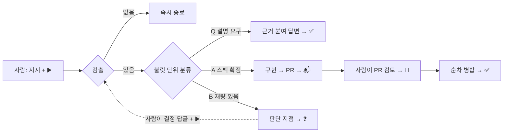

# slack-autopilot

슬랙 채널에 적은 개발 지시를 자동으로 검출해 **답하거나, 구현해 PR 로 만들거나, 사람에게
되돌리는** 범용 엔진. 사람이 하는 일은 셋뿐이다 — **쓰고, ▶️ 를 달고, 병합할 PR 에 🚀 를 단다.**

## 무엇이 어디에

| | 어디 | 무엇 |
|---|---|---|
| **엔진**(범용) | 이 레포 | 상태 기계·검출·락·자기 수정·병합 절차 |
| **정책**(프로젝트별) | 각 대상 레포의 `AUTOMATION.md` | 티어 경계·리뷰어·병합 금지선·결정 기록 규칙 |
| **검증** | 대상 레포의 CI | 테스트·e2e. 엔진은 결과만 읽는다 |
| **실행** | 클라우드 루틴(cron) | 주기 폴링. 유휴면 즉시 종료 |

**새 프로젝트를 붙이는 비용** = 그 레포에 `AUTOMATION.md` 작성 + 환경변수 2개.
엔진 수정이 필요했다면 분리가 샌 것이다.

## 문서

| 무엇이 궁금한가 | 문서 |
|---|---|
| 전체 그림 (다이어그램) | [architecture.md](docs/design/architecture.md) |
| 규칙 — 무엇을·왜 | [engine.md](docs/design/engine.md) |
| 실행 — 어떻게 도는가·실패 모드 | [runtime.md](docs/design/runtime.md) |
| 정책 파일 작성법 | [policy-contract.md](docs/design/policy-contract.md) |
| 설치·등록 절차 | [setup.md](docs/runbook/setup.md) |
| 결정의 근거 | [decisions.md](docs/decisions.md) |

## 설계의 축

- **상태는 슬랙에 있다.** 루틴은 매 실행이 새 세션이고 아무것도 기억하지 않는다. 이모지가
  상태라, 어느 실행이 죽어도 다음 실행이 같은 지점에서 잇는다.
- **사람의 입구는 둘뿐이다.** ▶️(진행)·🚀(병합). 봇은 이 둘을 **코드로 막혀** 못 붙인다.
- **유휴가 기본이다.** 대부분의 실행은 "할 일 없음 → 즉시 종료"다.
- **재량은 사람에게.** 봇은 스펙이 확정된 것만 구현한다.
