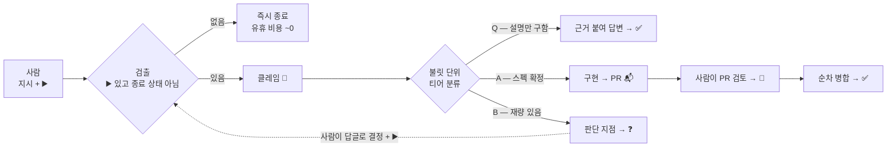
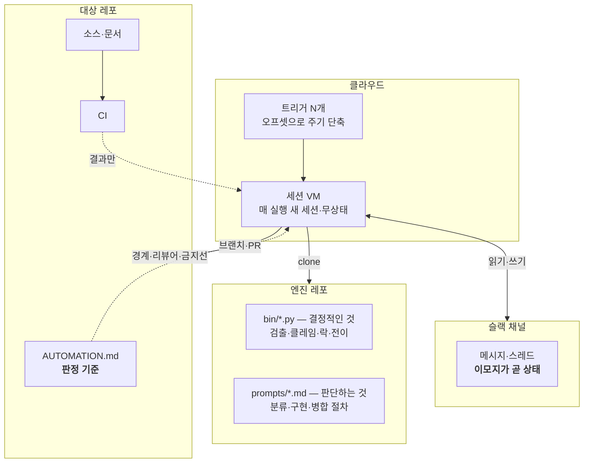
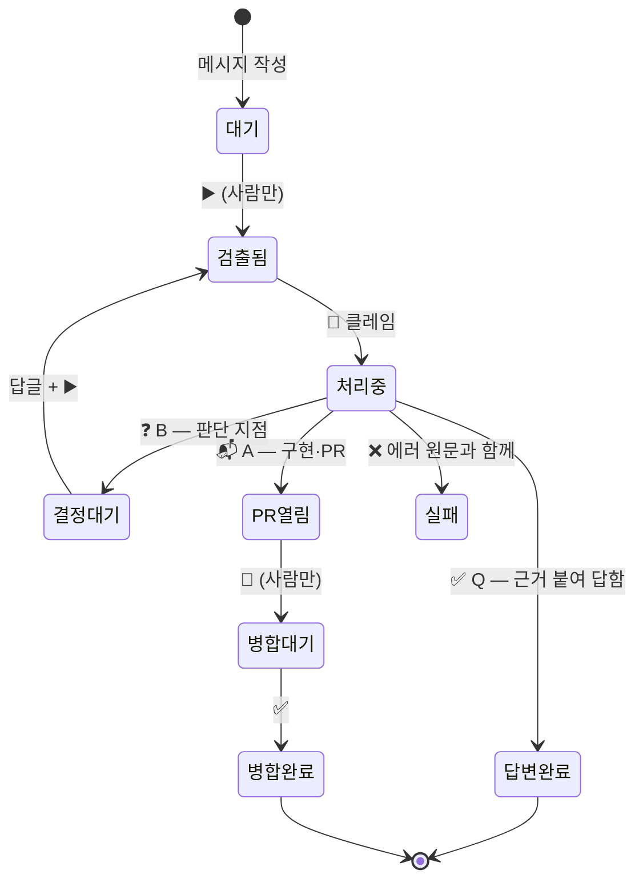
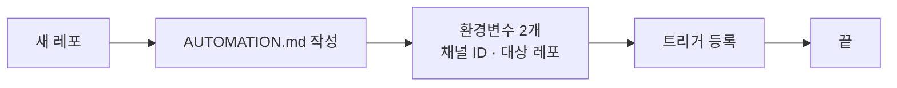

# 아키텍처

전체 그림만 담는다. 규칙은 [engine.md](engine.md), 실행·실패 모드는 [runtime.md](runtime.md),
근거는 [decisions.md](../decisions.md).

## 1. 전체 흐름



**되돌아오는 화살표가 이 설계의 심장이다.** ❓ 는 막다른 길이 아니라 대기열이고, 사람의
결정 한 줄이 B 를 A 로 바꾼다.

## 2. 층



세 가지 분리가 전부다:

| 분리 | 왜 |
|---|---|
| **엔진 ↔ 정책** | 프로젝트 지식이 엔진에 새면 범용성이 죽는다 |
| **코드 ↔ 프롬프트** | 코드는 테스트되고 싸다. 판단만 LLM 이 한다 |
| **엔진 ↔ 검증** | VM 에서 무거운 테스트를 돌리지 않는다. CI 가 한다 |

## 3. 상태 기계



- 사람이 붙이는 것은 **▶️·🚀 둘뿐**. 봇은 코드로 막혀 못 붙인다(`emoji.assert_bot_may_add`) —
  이것이 무한 루프를 구조적으로 불가능하게 한다.
- **종료 상태(✅·❌)는 검출에서 제외**된다. 안 그러면 끝난 일을 다시 집는다.

## 4. 동시성 — 무엇이 중복을 막나

```mermaid
sequenceDiagram
    participant R1 as 루틴 1
    participant R2 as 루틴 2
    participant G as GitHub
    participant S as 슬랙
    Note over R1,R2: 같은 노드를 동시에 봤다
    R1->>G: push auto/slack-&lt;ts&gt;
    R2->>G: push auto/slack-&lt;ts&gt;
    G-->>R1: OK — ref 생성은 원자적
    G-->>R2: 거절 — 이미 있음
    R1->>S: 💬 클레임
    Note over R2: 종료코드 1 → 건너뛴다
```

**락은 이모지가 아니라 원격 브랜치다.** `reactions.add` 는 진짜 test-and-set 이 아니지만
git 의 ref 생성은 서버에서 직렬화된다. 분류만 할 때는 최악이 답글 중복이라 이모지로 충분하고,
구현 단계에서는 같은 파일을 두 번 고치고 PR 이 둘 나므로 브랜치 락이 필수다.

락 해제는 없다 — **브랜치가 곧 상태**다. 대신 죽은 락 회수가 있다(PR 이 없고 브랜치가 오래
묵으면). 판단이 안 서면 회수하지 않는다: 남의 작업을 뺏는 쪽이 교착보다 비싸다.

## 5. 사람이 지키는 관문 둘

| 관문 | 무엇을 막나 |
|---|---|
| **티어 B** | 봇이 제품 결정을 대신 내리는 것 |
| **🚀 병합** | 자동 병합. CI 가 그린이어도 사람이 읽기 전엔 기본 브랜치에 못 들어간다 |

나머지(검출·분류·답변·구현·검증)는 전부 자동이다.

## 6. 새 프로젝트 붙이기



**엔진 수정이 필요했다면 분리가 샌 것이다** — 엔진에 새어든 프로젝트 지식을 정책 파일로 옮긴다.
