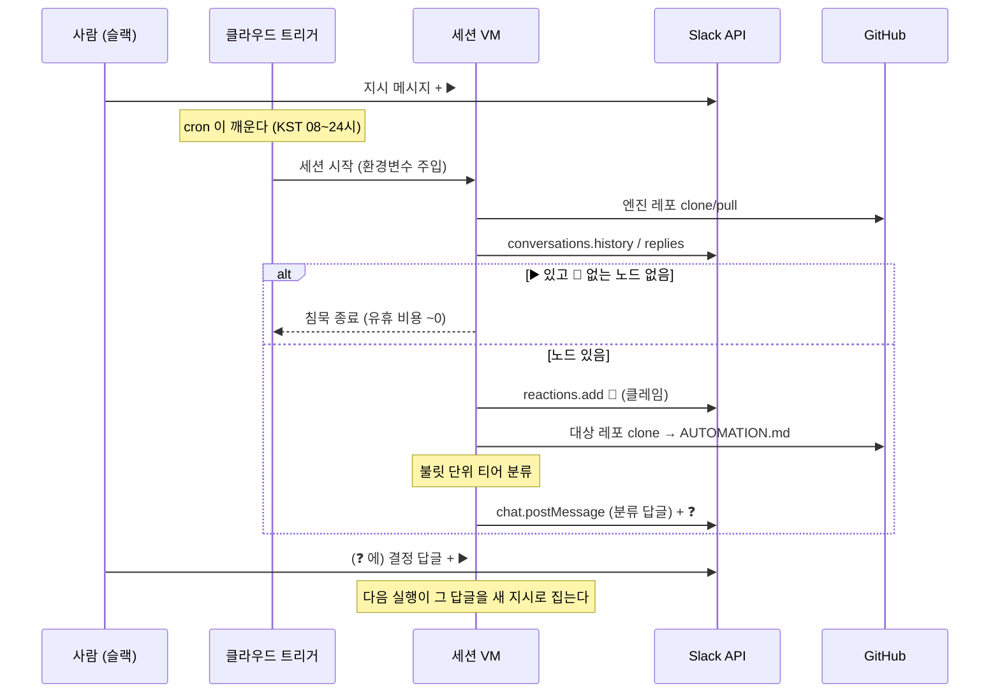

# 설계 — 런타임 (실제로 무엇이 어떤 순서로 도는가)

- 상태: 초안 (2026-08-16 갱신) — 4단계(구현·PR)까지 관통 확인, 5단계 트리거 등록.
- `engine.md` 가 **무엇을·왜**(상태 기계·규칙)라면, 이 문서는 **어떻게 도는가**다 —
  실행 순서, 코드 맵, 실패 모드, 지금 되는 것과 안 되는 것. 규칙이 궁금하면 `engine.md`,
  등록 절차는 `../runbook/setup.md`, 결정의 근거는 `../decisions.md`.
- 두 문서가 어긋나면 **`engine.md` 가 정본**이다. 여기는 구현의 기록이라 구현이 바뀌면 여기를 고친다.

## 1. 한눈에



**핵심 성질 셋** — 이것이 이 설계의 전부다:
1. **상태는 슬랙에 있다.** 루틴은 매 실행이 새 세션이고 아무것도 기억하지 못한다. 이모지가
   상태고, 그래서 어느 실행이 죽어도 다음 실행이 같은 판정으로 이어간다.
2. **유휴가 기본이다.** 대부분의 실행은 "▶️ 없음 → 즉시 종료"다. 여기서 요약·보고를 쓰면
   하루 수십 번의 침묵이 비용으로 바뀐다.
3. **사람의 입구는 둘뿐이다.** ▶️(진행)와 🚀(병합). 봇은 이 둘을 붙일 수 없고, 코드가 막는다.

## 2. 실행 표면

| 무엇 | 어디 | 비고 |
|---|---|---|
| 깨우는 것 | 클라우드 트리거 2개(구현 :00 · 병합 :30) | 최소 간격 1시간을 그대로 쓴다 — 유휴 실행이 곧 비용(D-013). KST 07~02시 |
| 도는 곳 | 세션 VM(Anthropic 호스팅) | 사람의 맥은 관여하지 않는다 |
| 자격 증명 | 전용 클라우드 환경의 환경변수 | 시크릿 저장소가 없어 **환경을 전용으로 가른다**(§7) |
| 슬랙 접근 | 봇 토큰 + Web API(python) | 커넥터(MCP) 의존 금지 — headless 런에 없을 수 있다 |
| GitHub 접근 | 프록시가 인증 | 레포를 붙이면 클론·push·PR 이 토큰 없이 된다. **우리 Authorization 헤더는 무시된다.** CI 상태(checks·statuses)는 프록시 범위 밖이라 세션 도구로 읽는다 |
| 무거운 검증 | 대상 레포 CI(4단계) | 에이전트가 e2e 를 직접 돌지 않는다 |

## 2.5 VM 은 이 맥과 다르다 (프롬프트를 쓰기 전에 볼 것)

**로컬에서 되는 것이 VM 에서 된다고 가정하지 않는다.** 2026-08-14 에 같은 종류로 두 번
죽었고, 둘 다 로컬에서는 통과했다.

| 로컬(맥) | 세션 VM | 여기서 생긴 사고 |
|---|---|---|
| `.env` 가 있다 | **없다**(gitignore, 값은 환경변수) | `. ./.env` 를 `&&` 체인에 두어 뒤가 통째로 안 돎 |
| git 자격이 있다 | **없다.** `gh` 도 없을 수 있다 | 프라이빗 레포 클론이 두 방법 모두로 실패 |
| `gh` 가 깔려 있다 | **아닐 수 있다** | 한 실행이 설치하느라 시간을 태웠다 → REST API 직접 호출로 전환 |
| 홈이 내 것 | 이전 세션 잔재가 있을 수 있다 | 남은 디렉터리 재사용 → `rm -rf` 후 새로 받는다 |
| 커넥터(MCP) 있음 | 없을 수 있다 | 슬랙을 커넥터로 부르지 않고 python 으로 직접 |
| 도구 다 있음 | `allowed_tools` 로 제한 | 목록에 없는 도구를 전제한 절차 금지 |

이 표의 항목은 `tests/test_prompts.py` 가 기계로 검사한다 — 사람 눈으로는 안 걸린다.

## 3. 코드 맵

```
bin/
  slack_api.py   Slack Web API 래퍼(표준 라이브러리만)
  emoji.py       상태 어휘 + 사람 전용 이모지 가드
  detect.py      상태별 노드 검출 → JSON (--mode triage|merge)
  mark.py        이모지 전이 + 스레드 답글
  lock.py        브랜치 락 — 구현 단계의 진짜 클레임(원격 ref 원자적 생성)
  report_failure.py  셋업 실패를 채널에 한 줄(실패까지 조용하면 눈이 없다)
config.json      채널↔레포 매핑(값이 아니라 **환경변수 이름**)
prompts/
  bootstrap.md   **트리거 프롬프트 정본** — 세 트리거가 이 3줄로 같다
  triage.md      3단계 — 분류만(코드 생성 없음)
  implement.md   4단계 — 구현·PR·자기 수정
  merge.md       5단계 — 🚀 이후 순차 병합
tests/
  test_detect.py 검출·이모지 가드 규칙(슬랙 없이)
  test_lock.py   락 회수 규칙(git·네트워크 없이)
  test_prompts.py 프롬프트가 VM 전제를 어기지 않는지(§2.5)
scripts/
  check-secrets.sh  토큰·슬랙 원시 ID 커밋 차단(pre-commit)
```

**의존은 python3 표준 라이브러리뿐**이다(`urllib`·`json`). pip 설치가 필요하면 VM 준비
단계가 생기고, 그 단계는 언젠가 실패한다. `config.json` 이 YAML 이 아닌 이유도 같다 —
표준 라이브러리에 YAML 파서가 없다.

### 왜 파일이 이렇게 갈렸나

- **`emoji.py` 를 따로 둔 이유**: 이모지 문자열이 여러 파일에 흩어지면 상태 정의가 조용히
  갈라진다. 사람 전용 가드(`assert_bot_may_add`)도 여기 있어서, 봇이 ▶️ 를 붙이려 하면
  **코드가 예외로 막는다**(D-002 를 문서가 아니라 실행이 강제한다).
- **`detect.py` 와 `mark.py` 를 가른 이유**: 검출은 읽기 전용이라 언제 몇 번 돌려도 안전하고,
  전이는 부수 효과가 있다. 섞어 두면 "확인만 해볼까"가 상태를 바꾼다.
- **프롬프트가 레포에 있는 이유**: 트리거는 단계마다 하나씩 생기고(구현·병합), 프롬프트를 트리거에
  넣으면 N 벌이 갈라진다 — **실제로 하루 만에 갈라졌다**(한쪽은 `--days 7`·Q 없음, 다른 쪽은
  14·Q 있음). 그래서 트리거에는 **갈라질 것을 두지 않는다**: 환경 확인·실패 보고·분류 규칙·
  절대 규칙을 전부 `triage.md` 로 옮기고, 트리거에는 "레포를 가져와 명세를 읽어라" 3줄만
  남겼다(`prompts/bootstrap.md` 가 그 정본). 트리거를 다시 건드릴 이유가 없으면 갈라지지 않는다.

## 4. 검출 — `detect.py`

```
python3 bin/detect.py --all-projects --days 14
```

1. `conversations.history(oldest = now - days)` 로 창을 읽는다(**기본 14일, 스캔·판정 공용**).
2. 각 메시지에서 `channel_join`·`channel_leave` 를 버린다(입퇴장에 이모지가 붙는 사고 방지).
3. **▶️ 있고 💬 없으면** 노드로 잡는다.
4. 스레드가 있으면(`thread_ts` 또는 `reply_count`) `conversations.replies` 로 답글도 **같은
   규칙으로** 본다 — 부모와 답글을 구분하지 않는다(D-006). 부모는 3번에서 이미 봤으므로 건너뛴다.
5. **오래된 것부터 정렬**해 낸다. 같은 스레드에서 지시 순서가 뒤집히면 나중 결정이 먼저 반영된다.
6. 결과가 없으면 `[]` — 호출부는 이것을 보고 즉시 종료해야 한다.

**창은 하나다.** 한때 스캔 범위와 판정 기준을 갈랐는데(부모는 멀리, 노드는 최근),
"**오래된 메시지 자체에 오늘 ▶️ 를 달면 안 잡힌다**"는 사각지대가 생겼고 증상이 침묵이라
보이지도 않았다. 슬랙 API 는 **이모지를 언제 달았는지 알려주지 않으므로** 메시지 나이로
근사할 수밖에 없는데, 그렇다면 근사가 틀리는 쪽을 줄이는 편이 낫다. 중복 처리는 신선도가
아니라 💬 클레임이 막는다 — 신선도의 일은 API 호출량 한정뿐이다.

출력 노드에는 `kind`(message|reply) · `ts` · `parent_ts` · `text` · `reactions` 가 들어간다.
`kind == "reply"` 면 소비자는 **부모 + 스레드 전문**을 컨텍스트로 읽어야 한다("그 항목"이
무엇인지는 스레드에만 있다).

### 검출 모드

같은 코드가 두 상태를 본다 — 규칙이 하나여야 상태 기계가 갈라지지 않는다.

| 모드 | 있어야 | 없어야 | 무엇을 찾나 |
|---|---|---|---|
| `triage` | ▶️ | 💬 | 새 지시(사람의 첫 입구) |
| `merge` | 🚀 | ✅ | 병합 지시 — 보통 PR 링크가 담긴 **봇 답글** |

두 모드가 서로를 침범하면 코드가 안 된 것을 병합하려 들거나 그 반대가 된다. 테스트로 고정돼
있다(`tests/test_detect.py::MergeMode`).

## 5. 클레임과 멱등성 — `mark.py`·`lock.py`

```
python3 bin/mark.py --channel C… --ts 123.456 --emoji speech_balloon
```

- `reactions.add` 가 이미 붙어 있으면 `already_reacted` 를 준다. 이것을 **test-and-set** 으로
  쓴다 — 두 실행이 겹치면 한쪽만 종료코드 0(`claimed`)을 받고, 진 쪽은 1(`already`)을 받아
  그 노드를 건너뛴다.
- **이건 보조 장치다.** `reactions.add` 는 진짜 test-and-set 이 아니다 — 이미 붙어 있을 때만
  거절한다. 분류만 하는 3단계에서는 최악이 답글 중복이라 이 정도로 충분하다.

**구현 단계의 진짜 락은 `lock.py` 다.** 원격 브랜치 ref 생성은 서버에서 직렬화되므로 승자가
하나다. 두 실행이 같은 노드를 잡으면 같은 파일을 두 번 고치고 PR 이 둘 나기 때문에, 여기서는
보조 장치로 부족하다.

```
python3 bin/lock.py --repo owner/name --ts <노드 ts>          # 새 작업(락 획득)
python3 bin/lock.py --repo owner/name --ts <ts> --reuse <브랜치>  # 미병합 PR 에 얹기
```

- 브랜치 이름은 노드 ts 에서 **유도**한다(`auto/slack-<ts>`) — 같은 노드는 늘 같은 이름이라
  재실행이 안전하다.
- **빈 브랜치를 먼저 민다.** 작업을 시작한 뒤에 밀면 그 사이 경쟁자가 같은 일을 한다.
- 종료코드 1 = 경쟁 패배(그 노드를 건너뛰라는 뜻). 이어서 하려면 `--reuse` 로 **의도를 드러내야**
  한다 — 스레드에 미병합 PR 이 있을 때만 그 브랜치에 얹는다(작업 파편화 방지).
- 순서는 **스레드 확인 → 락 → 💬 → 작업**.

### 죽은 락 회수

락 해제가 없는 설계라, 브랜치를 민 **직후** 실행이 죽으면 그 노드는 영원히 잠긴다 — 다음
실행은 브랜치가 있어 건너뛰고, 메시지에는 💬 가 붙어 있어 분류 검출에도 안 잡힌다. 조용한
교착이다. 그래서 회수 규칙을 둔다:

**PR 이 하나도 없고**(열렸든 닫혔든) **브랜치가 `--stale-minutes`(기본 120분)보다 오래됐으면**
죽은 락으로 보고 원격 브랜치를 지운 뒤 다시 잡는다(`mode: "reclaimed"`).

- **PR 이 있으면 아무리 오래돼도 회수하지 않는다** — PR 을 열었다는 것은 그 실행이 최소한
  거기까지 갔다는 뜻이고, 그 뒤는 사람이 볼 일이다.
- 기본값 120분은 자기 수정 상한(60분)의 두 배다. 살아 있는 작업을 뺏는 쪽이 교착보다 비싸서
  넉넉히 잡는다.
- **PR 조회가 실패하면 회수하지 않고 예외로 터진다.** 판단 불가일 때 회수하면 남의 작업을
  뺏는다 — 모르면 손대지 않는 쪽이 안전하다.
- 규칙은 `tests/test_lock.py` 가 고정한다(경계값·PR 존재·조회 실패 포함).
- 답글은 `--reply-file` 로 넘긴다. 본문을 인자로 넘기면 셸 인용 지옥에 빠지고, 한글이
  깨질 자리가 늘어난다.

## 6. 분류 — `prompts/triage.md`

판정은 두 층이고, 티어는 **셋**이다(D-007).

1. **범용 휴리스틱**(엔진):
   - **Q** — 바꾸라는 요구 없이 설명만 구함 → 봇이 코드·문서를 읽어 **답하고 ✅**
   - **A** — 무엇을 할지가 정해져 있고 어떻게만 남음 → 구현(4단계)
   - **B** — 무엇을 할지에 재량 → 판단 지점을 ❓
   "~하면 어때?"는 질문 형태여도 제품 결정이라 B 다. 이때는 답할 수 있는 부분을 답하고 남은
   재량만 ❓ 로 남긴다 — **한 불릿이 Q 와 B 를 겸할 수 있다.**
2. **프로젝트 정책**(대상 레포의 `AUTOMATION.md`): 그 위에 얹히고, **정책이 휴리스틱을 이긴다.**

**Q 는 봇이 말을 만들어낼 수 있는 유일한 자리다** — A 는 코드가, B 는 사람이 검증하지만 Q 는
답변 자체가 산출물이다. 그래서 근거 인용(파일·문서·결정 번호)과 결정 금지가 의무다(D-007 ③④).

판정 단위는 **메시지가 아니라 불릿**이다. 한 메시지에 성격이 다른 항목이 섞이기 때문이다.
애매하면 B — 잘못 A 로 분류해 구현하는 비용이 사람을 한 번 부르는 비용보다 훨씬 크다.

답글에는 **처리 N건 / 보류 M건(사유별)** 을 항상 적는다. 조용히 빠진 항목이 없어야 한다.

## 7. 자격 증명

클라우드 환경에는 **전용 시크릿 저장소가 없다** — 환경변수는 그 환경을 쓰는 모든 세션이 읽는다.
그래서 **환경 자체를 가른다**: `slack-autopilot` 전용 환경을 만들고 거기에만 토큰을 둔다.
다른 루틴들(식단·할 일 등)은 Default 환경에 남아 토큰을 보지 못한다.

- 필요한 변수: `SLACK_BOT_TOKEN` · `SLACK_CHANNEL_ID_<프로젝트>` · `TARGET_REPO_<프로젝트>`
- **없으면 아무것도 하지 않는다** — 루틴은 "환경변수 누락"만 남기고 종료한다. 빈 값으로
  엉뚱한 채널을 조회하는 것보다 안 도는 편이 낫다.
- 토큰 값은 어떤 경로로도 출력하지 않는다(마스킹해서도). 로컬 `.env` 는 gitignore 이고
  pre-commit 가드가 토큰·슬랙 원시 ID 를 막는다.

## 8. 실패 모드와 신호

| 증상 | 진짜 원인 | 조치 |
|---|---|---|
| `not_in_channel` | 봇이 채널에 없다 | `/invite` 가 아니라 **"이 채널에 에이전트 및 앱 추가"**(setup.md §1.5) |
| `missing_scope` | 스코프 부족 | 필요한 것만 추가하고 재설치. `conversations.list` 를 쓰려다 `channels:read` 를 늘리지 말 것 |
| "환경변수 누락" | 전용 환경에 값이 없거나 트리거가 다른 환경을 가리킴 | 트리거의 `environment_id` 확인 |
| **아무 일도 안 일어남**(이모지·답글 무변화) | **기본 Trusted 네트워크가 `slack.com` 을 막는다** — 허용 목록에 슬랙이 없다 | Network access 를 **Custom** 으로, `slack.com` 추가 + "기본 패키지 매니저 목록도 포함" 체크(setup.md §3.5 ④) |
| `gh: command not found` | **VM 에 `gh` 가 없다** — 설치돼 있다고 가정하지 않는다 | `gh` 를 쓰지 않는다. `bin/github_api.py` 가 REST API 를 직접 부른다 |
| `could not read Username for 'https://github.com'` | **VM 에 GitHub 자격이 없다.** 엔진 레포는 퍼블릭이라 그냥 클론되지만, 대상 레포 push·PR 은 자격이 필요하다 | `github_api.setup_git()` 이 자격 저장 파일을 깔아둔다. 주소에는 토큰을 넣지 않는다 |
| `GitHub access is not enabled for this session` (HTTP 403) | **루틴에 레포가 안 붙었거나 `allowed_tools` 로 조였다.** 토큰·App 문제가 아니다 | `session_context.sources` 를 넣고 도구 제한을 풀라 — 자세히는 [troubleshooting.md](../troubleshooting.md) |
| 같은 노드가 두 번 처리됨 | 클레임 전에 작업을 시작했다 | 순서는 **클레임 → 작업**. 4단계에서는 브랜치 push 가 먼저 |
| 봇이 자기 답글을 다시 집음 | ▶️ 를 봇이 붙였다는 뜻 — 있을 수 없다 | `emoji.assert_bot_may_add` 가 막는다. 뚫렸으면 그게 사고다 |

## 9. 비용 특성

- 유휴 실행의 실질 비용은 **에이전트 부팅**(시스템 프롬프트 + 도구 스키마)이다. 검출 자체는
  거의 공짜다. 그래서 **도구를 줄이는 것**이 가장 큰 절약이다 — 이 루틴은 `Bash`·`Read`·
  `Grep`·`Glob` 만 쓰고 MCP 커넥터를 쓰지 않는다(슬랙을 python 으로 직접 부르므로).
- 클라우드 루틴은 컴퓨트가 무과금이고 **레이트리밋을 대화 세션과 공유**한다. 유휴 폴링이
  사람의 작업 예산을 깎으므로 주기를 무작정 줄이지 않는다.
- 사용량은 로컬 집계 도구(ccusage 류)에 잡히지 않는다 — 클라우드 루틴은 로컬 CLI 세션이 아니다.

## 10. 지금 되는 것 / 아직 안 되는 것

| 단계 | 상태 |
|---|---|
| 1. 봇 앱·토큰·채널 추가 | ✅ 2026-08-14 |
| 2. 엔진 스크립트 + 정책 파일 | ✅ (`bin/*` + 대상 레포의 `AUTOMATION.md`) |
| 3. 검출·분류 루틴 | ✅ **작동 확인**(2026-08-14 실채널 관통) |
| 4. 구현·PR + 자기 수정 | ✅ **관통 확인**(2026-08-16) — 검출 → 💬 → 락 브랜치 → 구현 → CI 그린 → PR → 📬 까지 사람 개입 없이. 트리거 3개 :00·:20·:40, KST 07~02시 |
| 5. 병합 루틴(🚀) | 🔶 **트리거 등록**(:10, KST 07~02시) — 🚀 실사용 검증 아직 |
| 6. 동시 3개 확장 | ☐ 미구현 |

4단계를 켜는 데 가장 오래 막힌 것은 분류 정확도가 아니라 **GitHub 접근**이었다 — 원인은
루틴에 레포를 안 붙인 것과 `allowed_tools` 로 도구를 좁힌 것, **둘 다 우리 설정**이었다
([troubleshooting.md](../troubleshooting.md)). 다음 프로젝트를 붙일 때 여기서 시간을 태우지 않는다.

5단계를 켜기 전에 확인할 것:
- 3단계 분류 정확도를 실사용 표본으로 본다. 분류가 틀린 채로 구현을 켜면 봇이 제품 결정을
  대신 내린다(그래서 단계를 나눈 것이다).
- VM 에서 대상 레포에 **push 권한이 실제로 나오는지** 확인한다(GitHub 프록시 경유). 이건
  4단계 첫 실행에서만 드러난다.
- 스크린샷이 붙은 지시가 흔하다면 `files:read` 스코프를 먼저 정한다(§11 미결).

## 11. 실제로 돈 첫 사이클

설계가 종이에서만 돌지 않았다는 기록. 상태 전이가 문서대로 갔다.

1. 사람: 불릿 여러 개가 든 메시지 + ▶️
2. 봇: 💬 클레임 → 분류 → 스레드 답글 + ❓
   - 한 불릿은 코드를 읽어 "이미 되고 있다"를 확인하고 판단 지점을 셋으로 갈랐다.
   - 물음표로 끝난 불릿은 규칙대로 B.
3. 사람: 결정을 **답글로** 적고 그 답글에 ▶️
4. 봇: 그 답글을 새 지시로 검출(재투입 루프가 실제로 작동) → 💬 → 처리
5. 결과를 스레드에 남기고 ✅

**배운 것**: 스크린샷이 결정적이었는데 봇 토큰에 `files:read` 가 없어 사람이 대신 읽었다.
이미지가 흔한 채널이라면 구현 단계 전에 스코프를 정해야 한다(미결).
